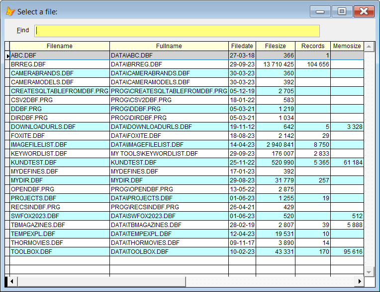
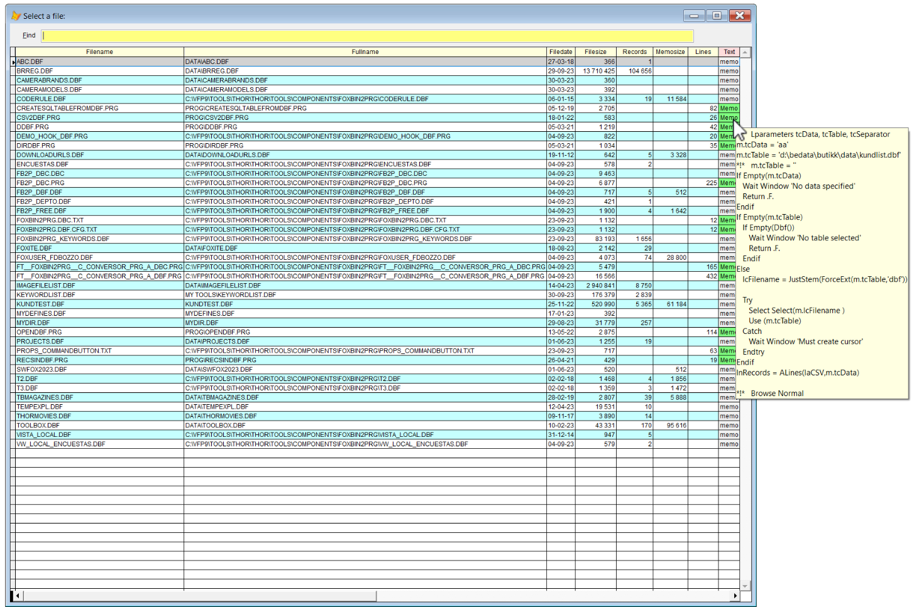
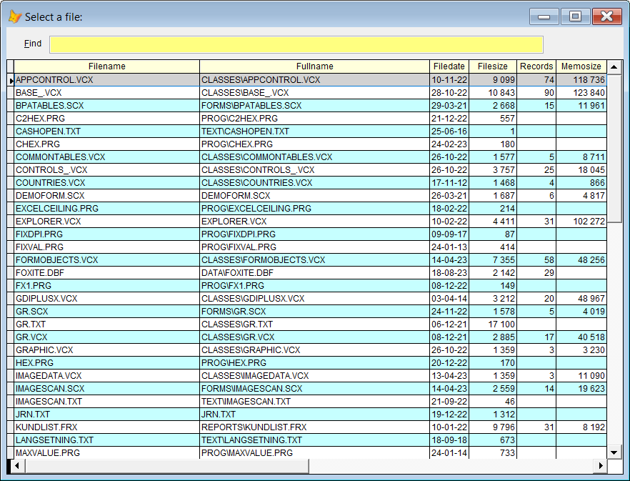
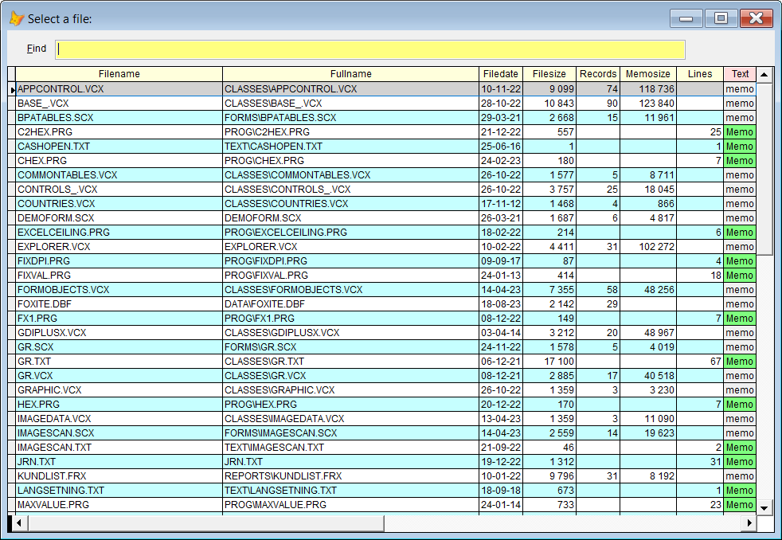

## File Picklists (advanced Dir)</a>  

**Pandora** comes with a nice "file finder" with several options. For instance it will show the number of records in all DBF's plus the size of the corresponding memo file.    
The simplest syntax is `*` which finds all the VFP related files in your path. Pick one with the arrow keys or the mouse, or start typing, and press **Enter**.  

To start with a more limited selection of files, you can specify one or more "words" from the file name. If the "words list" contains a `.` (dot), you can also specify the extension. In that case also non VFP files are included in the search.  

|C/E| You type:                |        Result after pressing `F8`                                |
|--|:-------------------------|:----------------------------------------------------------|
|CE| dir                      | Picklist of all VFP files in the path |  
|CE| dir db                   | As above, shows only files having `db` in its name *or* extension|
|CE| dir db cust               | Shows all files with names containing  `db` *and* `cust` |  
|CE| dir my .prg              | Shows all files with `my` in the name *and* `prg`as extension|
|CE| dir .ini              | Shows all files `.ini` files |
| C| / my .prg                | Same as above, a single `/` is short for `dir`|  
| C| *                        | Same as `dir`                                 |
| C| * db                      | Same as `dir db`                               |

#### The C/E column describes where the "command" (keyword) works: 
**C:** Command Window   
**E:** program editor (Modify Command) and the text editor (Modify File) 

<a id="dirc">  

### Option 1: Dirc </a>
`dirc` adds two more columns, `lines` and `text`. The contents of **all** .prg, .txt and .h files, and the corresponding number of lines, are read into the `text` and `lines` columns.  

This gives two big advantages:  
1. The incremental search also includes the contents of the files.
2. Hover the mouse over the field `text`, and you will see the file contents as a tooltip.

Sample:  

| You type:                |        Result after pressing `F8`                                |
|:-------------------------|:----------------------------------------------------------|
| dirc        | The content of all VFP text files is read into the field *text*|
| dirc my        | Same as above, only files matching *my* are shown|

**Comment:** This feature is *not* default since it will in many cases show "unwanted" files when incremental search is used.

Notice that the content of the files can be seen as a tooltip for all relevant files. For these files the `text` field is green.

<a id="dirr">  

### Option 2: Dirr </a>

`dirr:` adds the record count for **all** VFP "tables", including dbc, frx, lbx, scx, vcx, pjx and mnx. This is very handy for evaluating the complexity of unknown projects.  

Sample:  

| You type:                |        Result after pressing `F8`                                |
|:-------------------------|:----------------------------------------------------------|
| dirr        | Will also show the number of records in all VFP "tables"|
| dirr my        | Number of records in all VFP "tables" with `my` in the name|
| dirr reports\        | Number of records in all VFP "tables" in the reports folder |
| dirr .scx       | Number of records in all scx files|

**Comment:** This feature is *not* default since it slows down the process considerably, and the extra information is only needed in special cases. Also note that it does include deleted records, in other words it does *not* respect *Set Deleted*.

**Note:** You can combine option 1 and option 2:

| You type:                |        Result after pressing `F8`                                |
|:-------------------------|:----------------------------------------------------------|
| dirrc        | Number of records as described above, *and* program code is added|
| dircr      | Same as above |  

Notice that the content of the files can be seen as a tooltip for all relevant files. For these files the `text` field is green.

**Shortcut in the Command Window:**  
In the Command Window you can type a single `*` instead of `dir`. Additional characters are allowed to narrow the result set. 

| In the Command Window, you type:                |        Result after pressing `F8`                                |
|:-------------------------|:----------------------------------------------------------|
| \*        | Picklist of all VFP files in the path|
| \* abc        | Same as above, only files with `abc` in the name|
| \*:c      | The content of the prg, txt and h files is read into the field *text* |
| \*:r        | Will also show the number of records in all VFP "tables"|
| \*:rc        | Combination of all the above|
| \*:cr        | Same as above|

**Comment:** Note the colon, `:`, it's necessary to enable the options in the command window.
