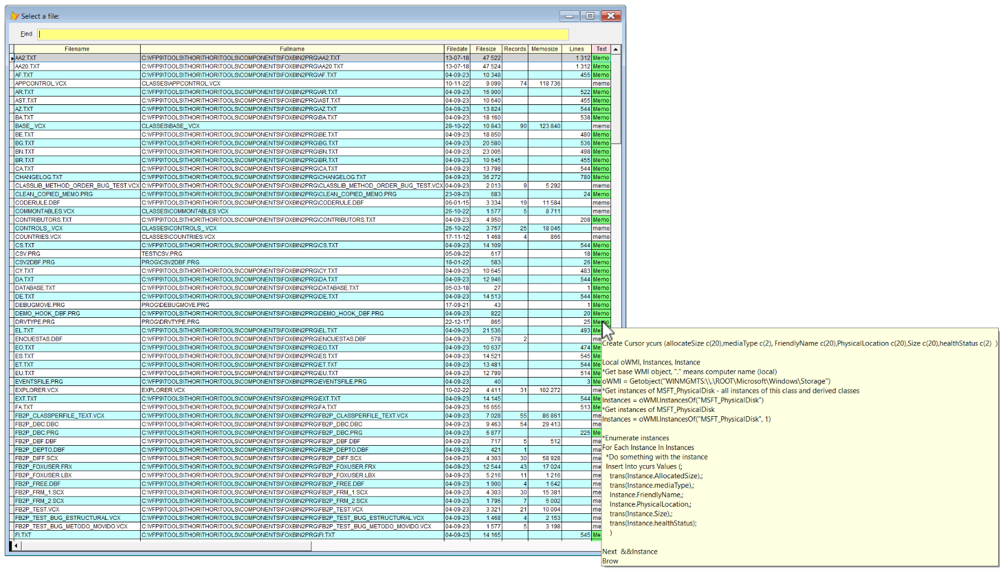

## File Picklists (advanced Dir)</a>  

**Pandora** comes with a nice "file finder" with several options. For instance it will show the number of records in all DBF's plus the size of the corresponding memo file.    
The simplest syntax is `*` which finds all the VFP related files in your path. Pick one with the arrow keys or the mouse, or start typing, and press **Enter**.  

To start with a more limited selection of files, you can specify one or more "words" from the file name. If the "words list" contains a `.` (dot), you can also specify the extension. In that case also non VFP files are included in the search.  

### Syntax overview
All the commands have two version, one "long" and one "short", these are interchangeable. 

| Command| Short version            |        Result after pressing `F8`                                |
|:--|:-----------------------|:----------------------------------------------------------|
|dir| \* (or \*:)                     | Picklist of all VFP files in the path |  
|dir bb| \* db  (or \*: dbnote 1)                 | As above, shows only files having `db` in its name *or* extension|
|dir db cust | \* db cust       | Shows all files with names containing  `db` *and* `cust` |  
|dir my .prg | \* my .prg          | Shows all files with `my` in the name *and* `prg`as extension|
| dir .png | \* .png             | Shows all files `.png` files |
|dirx| \*\* (or **:note 1)               | Same as Dir, with more information, se below|  

### Note 1: 
In order **not** to "collide" with comments in the editor windows, the short form of the syntax **must** include the colon (**:**) after the one or two asterisks (\*). 

<a id="dirc">  

### More info, syntax options Dirx and **: </a>
`dirx` or `**` adds several more columns, and more information:  
* **Lines column:** the number of lines in all .txt, .prg, .h and .pan files
* **Text column:** the content of the files as mentioned above   
* **Memosize column:** the size, in bytes, of the corresponding memo files.  
* In addition, the record size information is filled in for **all** VFP tables, including .dbc and .*x files. This can be very handy for analyzing the complexity of applications.

This gives two big advantages:  
1. Hover the mouse over the field `text`, and you will see the file contents as a tooltip.
1. The incremental search also includes the contents of the files.

