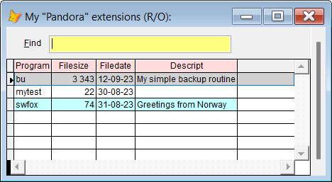
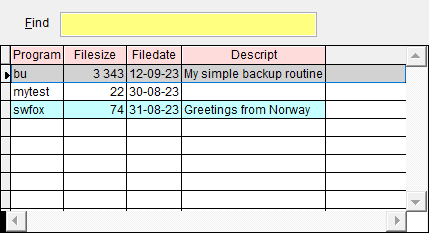

## Create your own *Pandora* extensions

The key to using your own **Pandora** extensions, is to remember the `!` symbol. Think "VFP uses ! as shortcut for **run**".  

All **Pandora** extensions must be named `pan_xxx.prg` where `xxx` is the name of the tool.  

To create a tool, type `!xxx` and press `F8`. You are told that the file doesn't exist, and asked if you want to create it. If you confirm, the file is created in one of the following folders:
1. prog (if it exists)
1. prg (if it exists)
1. the default folder  

Write the code you want, and save it.

#### To "run" a `Pandora` extension:  
Type the same as mentioned above, `!xxx`, and press `F8`. **Pandora** will locate the file and run it.  

#### To see a list of all your **Pandora** extensions:

| You type:                |        Result after pressing `F8`                                |
|:-------------------------|:----------------------------------------------------------|
| ! | Lists all your **Pandora** extensions|
|pan| Same as above|   

Select the one you want, and press **Enter** to run it.

<a id="paned">

#### To modify a **Pandora** extension:  </a>

| You type:                |        Result after pressing `F8`                                |
|:-------------------------|:----------------------------------------------------------|
| !!    | Lists all **Pandora** extensions|
| paned | Same as above|  
| !!xxx | Same as above, name contains `xxx` |
| !! xxx| Same as above|
| paned xxx| Same as above (note the space after `paned` |

Select the one you want to edit, and press **Enter**.

