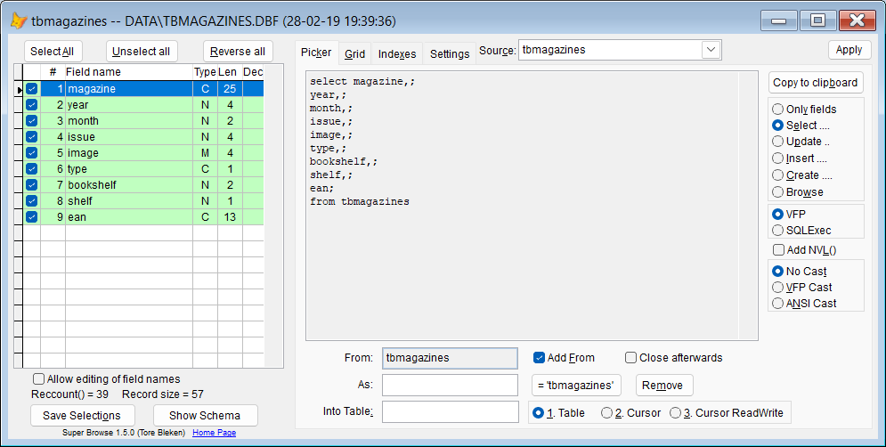

## Open SuperBrowse as a field picker for SQL statements.  

| You type:                |        Result after pressing `F8`                                |
|:-------------------------|:----------------------------------------------------------|
| Fp | SuperBrowse opens the currently selected table or cursor |
| FP xxx | SuperBrowse opens with the named table or cursor |  

Select the fields and options you need, and press `Apply`. 

