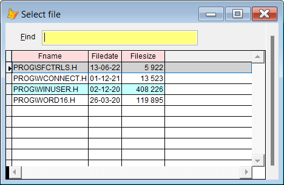

## INC (or #)

This keyword is a helper to include a header file, .h, into your program. Type `inc` or `#` and press `F8`, and you get a dropdown list of all the .h files in your path.

| You type:  | After pressing `F8`                                                                  |
|:----------|:--------------------------------------------------------------------------------------|
| inc | Picklist of all .h files in your path |
| inc w | Picklist of files matching \*w\*.h in your path |
| # w | Same as above, \# and inc are interchangeable   |

The result after pressing `Enter` is `#include yourfile.h`

