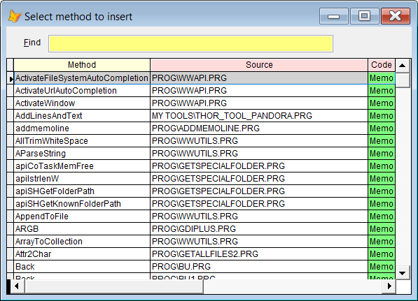

## Insert the code from another prg 

Often you want to insert the code from another prg into the active file. Typically this is a small code snippet or a function. Or it can be a header file, or even a complete prg file.  

With **Pandora** this is extremely simple:

| Command | Short  | Result after pressing `F8`|
|:----------|:--|:--------------------|
| ins | + | A list of all procedures in all the prgs in the path  |
| ins xxx | +xxx | Same as above, only procedures with xxx in its name|
| ins xxx.prg| +xxx.prg| The whole contents of xxx.prg is inserted|
| ins xxx.h | +xxx.h  | The complete contents of xxx.h is inserted |

If you don't specify any file extension, you can hover the mouse over the green cells, and see what will be inserted. Pick the function you want, and press `Enter`.

***Note:*** This function only works in a VFP editor
