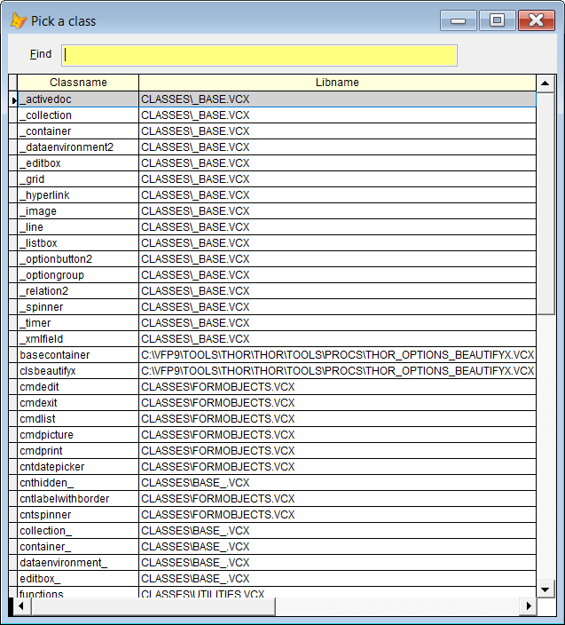

## NO (NewObject builder)</a>  
`NO` is short for NewObject, and is a helper to create the correct syntax. Also the corresponding Local declaration is added where it's appropriate.  
The syntax is best shown by samples. Pressing `F8` will present a dropdown of matching candidates. The entered text will be replaced by new code.

This is what happens in a prg or a method code window:  

| You type:  | After pressing `F8`                                                                  |
|:----------|:--------------------------------------------------------------------------------------|
| no lo zip | Local lo as zipfiles of utilities.vcx lo = NewObject('zipfiles', 'utilities.vcx')  |
| no lo=zip | Same as above, = is optional                                                          |
| no lo zip!| Same as above, ! forces a refresh of the option list                                  |
| no zip    | Local loZip as zipfiles of utilities.vcx loZip = NewObject('zipfiles', 'utilities.vcx') |
| no lo \*ut| Shows a list where `ut` is somewhere in a class name                                  |
| no loVar +ut    | Shows list where `ut` is in a class name or a classlib name                     |
| no myObj.Lo zip | myobj.NewObject('lo','zipfiles', 'utilities.vcx')                               |

The last sample shows the syntax to call an object's NewObject method.  

**Note 1:** In the Command window, no Local declaration is added.  
**Note 2:** `No` calls an external "dynamic snippet", which is why the results show in a popup instead of a grid.

