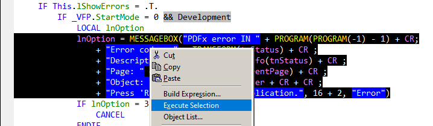

## Execute Selected Text 

`Pandora` will call Thor tool [Execute Selected Text](https://github.com/VFPX/Thor/blob/master/Docs/NewsItems/Item_46.md). From its documentation:  
*This tool is an extension of the familiar option in the context menu when editing code:*  

The tool provides three new features:

1. If **NO** text is selected, the entire (possibly multiple line) statement is highlighted and executed. The cursor can be anywhere in any line of the statement. In other words, click somewhere in the statement and run the tool to execute the statement.

2. All defined constants will work (instead of failing as they do when using the context menu). That means all defined constants from #Define or #Include directives as well as the include files from VCXs and SCXs. Note, for example, the use of CR in the image above.

3. A plug-in is provided for you to handle the selected text; you might save it in the clipboard or some history file.

**Note:** This also works for single lines.

The old way: Mark everything, right-click and select Execute Selection. 
The new way: Place the cursor anywhere inside the line/statement, and press `F8`! 
